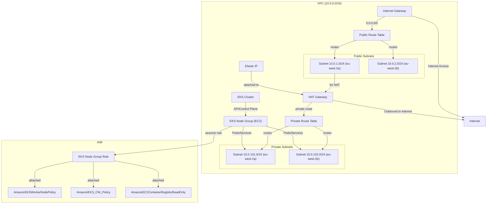

# Infrastructure Architecture Diagram

Below is a simple architecture diagram for the AWS infrastructure provisioned by this project. You can copy this Mermaid code into the [Mermaid Live Editor](https://mermaid.live/) or compatible Markdown viewers to visualize it.

---
